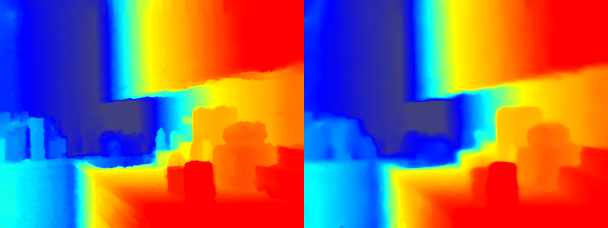

# CSPN(ECCV 2018)

A paddle implementation of the paper CSPN: Depth Estimation via Affinity Learned with Convolutional Spatial Propagation Network 
[\[CVPR 2018\]](https://openaccess.thecvf.com/content_ECCV_2018/html/Xinjing_Cheng_Depth_Estimation_via_ECCV_2018_paper.html)

## Abstract

Depth estimation from a single image is a fundamental problem in computer vision. In this paper, we propose a simple yet effective convolutional spatial propagation network (CSPN) to learn the affinity matrix for depth prediction. Specifically, we adopt an efficient linear propagation model, where the propagation is performed with a manner of recurrent convolutional operation, and the affinity among neighboring pixels is learned through a deep convolutional neural network (CNN). We apply the designed CSPN to two depth estimation tasks given a single image: (1) To refine the depth output from state-of-the-art (SOTA) existing methods; and (2) to convert sparse depth samples to a dense depth map by embedding the depth samples within the propagation procedure. The second task is inspired by the availability of LIDARs that provides sparse but accurate depth measurements. We experimented the proposed CSPN over two popular benchmarks for depth estimation, ie NYU v2 and KITTI, where we show that our proposed approach improves in not only quality (e.g., 30% more reduction in depth error), but also speed (e.g., 2 to 5$ imes$ faster) than prior SOTA methods.

## Training

**NYU Depth dataset training**

Run the script `sh ./scripts/train_cspn.sh` to train on NYU Depth V2 dataset.

You can use VisualDL to visualize the training process.
Run the script `visualdl --logdir ./log`

## Validation & Visualization

Run the script `sh ./scripts/evaluate_cspn.sh` to test the trained model on NYU Depth V2 dataset and visualize the results.
The visualization results are saved in `./out/`.



[comment]: <> (**Results:**)

[comment]: <> (| Data                                     | RMSE   | REL    | DELTA1.02 | DELTA1.05 | DELTA1.10 |)

[comment]: <> (| ---------------------------------------- | ------ | ------ | --------- | --------- | --------- |)

[comment]: <> (| `NYU&#40;Fast Unpool, pos affinity&#41;` Pytorch | 0.1169 | 0.0161 | 0.8300    | 0.9347    | 0.9708    |)

[comment]: <> (| `NYU&#40;Fast Unpool, pos affinity&#41;`  Paddle | 0.1111 | 0.0151 | 0.8416    | 0.9386    | 0.9729    |)

## Models

The trained models, UNet+CSPN in the paper can be downloaded here:

CSPN (NYU, Fast Unpool, pos): [Paddle model](https://drive.google.com/file/d/1IUi72XE7-_WsEStU2wzwTEGNupWsrEk6/view?usp=sharing)

## Citation

If you find this code useful in your research, please cite:

```
@InProceedings{Cheng_2018_ECCV,
author = {Cheng, Xinjing and Wang, Peng and Yang, Ruigang},
title = {Depth Estimation via Affinity Learned with Convolutional Spatial Propagation Network},
booktitle = {Proceedings of the European Conference on Computer Vision (ECCV)},
month = {September},
year = {2018}
}
```

[comment]: <> (## Links)

[comment]: <> (Original Project: [Pytorch Version]&#40;https://github.com/XinJCheng/CSPN&#41;)
