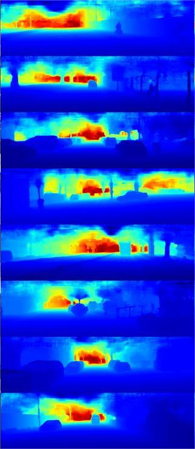
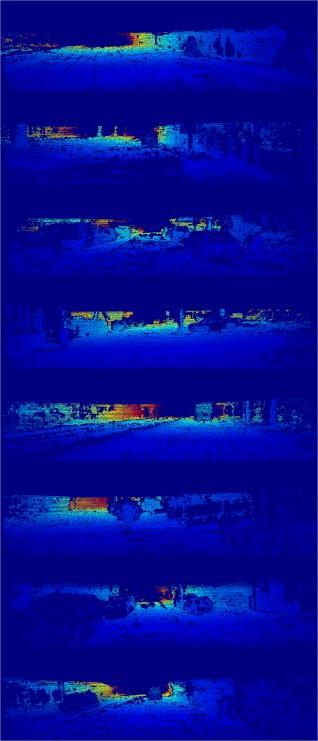

# FCFRNet(AAAI2021)
A paddle implementation of the paper FCFRNet:A paddle implementation of the paper FCFRNet: Fusion based Coarse-to-Fine Residual Learning for Monocular Depth Completion, 
[\[AAAI 2021\]](https://openaccess.thecvf.com/content/CVPR2021/html/Shen_CFNet_Cascade_and_Fused_Cost_Volume_for_Robust_Stereo_Matching_CVPR_2021_paper.html)


| rgb            | input depth            | pred dense dpeth        | groundtruth            |
|----------------|------------------------|-------------------------|------------------------|
|  |  |  |  |


</font>

## Abstract
Depth completion aims to recover a dense depth map from a sparse depth map with the corresponding color image as input. Recent approaches mainly formulate the depth completion as a one-stage end-to-end learning task, which outputs dense depth maps directly. However, the feature extraction and supervision in one-stage frameworks are insufficient,limiting the performance of these approaches. To address this problem, we propose a novel end-to-end residual learning framework, which formulates the depth completion as a twostage learning task, i.e., a sparse-to-coarse stage and a coarseto-fine stage. First, a coarse dense depth map is obtained by a simple CNN framework. Then, a refined depth map is further obtained using a residual learning strategy in the coarse-tofine stage with coarse depth map and color image as input. Specially, in the coarse-to-fine stage, a channel shuffle extraction operation is utilized to extract more representative features from color image and coarse depth map, and an energy based fusion operation is exploited to effectively fuse these features obtained by channel shuffle operation, thus leading to more accurate and refined depth maps. We achieve SoTA performance in RMSE on KITTI benchmark. Extensive experiments on other datasets future demonstrate the superiority of our approach over current state-of-the-art depth completion approaches.


## Dataset
In this framework, you need  download frist step( sparse to coarse) data in Aistudio.You can download sparse to coarse depth image from the following link.Sparse to Coarse is trained using STD. 

train-001: https://aistudio.baidu.com/aistudio/datasetdetail/176620

train-002: https://aistudio.baidu.com/aistudio/datasetdetail/176630

train-003: https://aistudio.baidu.com/aistudio/datasetdetail/176641

train-004: https://aistudio.baidu.com/aistudio/datasetdetail/176648

train-005: https://aistudio.baidu.com/aistudio/datasetdetail/176663

train-006: https://aistudio.baidu.com/aistudio/datasetdetail/176677

train-007: https://aistudio.baidu.com/aistudio/datasetdetail/176682

val: https://aistudio.baidu.com/aistudio/datasetdetail/176686

Warning: These files are about to 50GB，please ensure you have enough  space to store.

When you have unzip these zip file.You need to create a file and run the following code in shell.

```bash
mkdir data
%cd data
mkdir train
mkdir val
%cd ~
```
Please make sure you move `train-001` to `train-007` files to `train` folder ,and move `val` files to `val` folder

```bash
train-001《====》2011_09_26_drive_0059_sync
train-002《====》2011_09_28_drive_0016_sync

|---data
|     |---train
|     |       |----2011_09_28_drive_0016_sync
|       .....
|     |       |----2011_10_03_drive_0042_sync
|     |---val
|     |       |----val/2011_09_26_drive_0002_sync
|       .....
|     |---depth_selection
|     |       |----test_depth_completion_anonymous
|     |       |----test_depth_prediction_anonymous
|     |       |----val_selection_cropped
|     |---data_json
```

**Note**:Besides you need to know that the zip file only include dense depth input image.You need to download rgb and groundtruth image form [KITTI Raw Website](http://www.cvlibs.net/datasets/kitti/raw_data.php) and [KITTI official Website](http://www.cvlibs.net/datasets/kitti/eval_depth.php?benchmark=depth_completion).

## Training

**Important Note** : You need to download Coarse map (which predicted by STD) from the URL above.


you can run this 
```bash
python evaluate.py -c ./model_document/FCFRNet/FCFRNet.yaml
```
## Evaluation

**Important**:for evaluation , you need to download sparse to coarse depth val image  from [this website](https://aistudio.baidu.com/aistudio/datasetdetail/175535/0)
and employ it as input of the proposed network.

[comment]: <> (We use the result of )

[comment]: <> (.you need it to replace sparse depth input image.Besides,you aslo need to download weight from [this]&#40;https://aistudio.baidu.com/aistudio/datasetdetail/176607&#41;)

you can run this 
```bash
python evaluate.py -c ./model_document/FCFRNet/FCFRNet.yaml
```


## Models

[Pretrained Model](https://aistudio.baidu.com/aistudio/datasetdetail/176607)
You can use this checkpoint to reproduce our reported result.

## Citation

If you find this code useful in your research, please cite:

```
@article{DBLP:journals/corr/abs-2012-08270,
  author    = {Lina Liu and
               Xibin Song and
               Xiaoyang Lyu and
               Junwei Diao and
               Mengmeng Wang and
               Yong Liu and
               Liangjun Zhang},
  title     = {FCFR-Net: Feature Fusion based Coarse-to-Fine Residual Learning for
               Monocular Depth Completion},
  journal   = {CoRR},
  volume    = {abs/2012.08270},
  year      = {2020},
  url       = {https://arxiv.org/abs/2012.08270},
  eprinttype = {arXiv},
  eprint    = {2012.08270},
  timestamp = {Tue, 10 Aug 2021 17:46:20 +0200},
  biburl    = {https://dblp.org/rec/journals/corr/abs-2012-08270.bib},
  bibsource = {dblp computer science bibliography, https://dblp.org}
}
```

