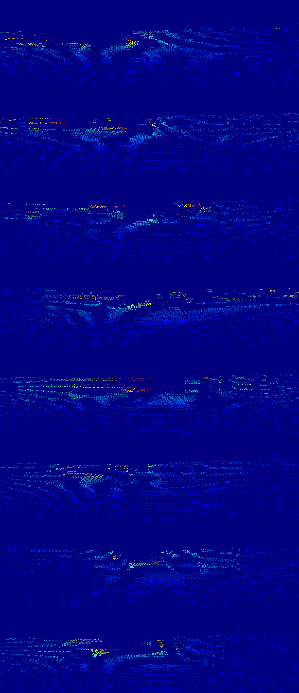

# GuideNet (IEEE Transactions on Image Processing, TIP)

A paddle implementation of the paper [Learning Guided Convolutional Network for Depth Completion](https://dl.acm.org/doi/10.1109/TIP.2020.3040528).

when you train this model in 'rgbd' mode, you will get the following reslut.

| RGB | input depth | pred dense dpeth | 
|:------:|:------:|:------:|
|  |  |  |


## Abstract

Dense depth perception is critical for autonomous driving and other robotics applications. However, modern LiDAR sensors only provide sparse depth measurement. It is thus necessary to complete the sparse LiDAR data, where a synchronized guidance RGB image is often used to facilitate this completion. Many neural networks have been designed for this task. However, they often na\"ıvely fuse the LiDAR data and RGB image information by performing feature concatenation or element-wise addition. Inspired by the guided image filtering, we design a novel guided network to predict kernel weights from the guidance image. These predicted kernels are then applied to extract the depth image features. In this way, our network generates content-dependent and spatially-variant kernels for multi-modal feature fusion. Dynamically generated spatially-variant kernels could lead to prohibitive GPU memory consumption and computation overhead. We further design a convolution factorization to reduce computation and memory consumption. The GPU memory reduction makes it possible for feature fusion to work in multi-stage scheme. We conduct comprehensive experiments to verify our method on real-world outdoor, indoor and synthetic datasets. Our method produces strong results. It outperforms state-of-the-art methods on the NYUv2 dataset and ranks 1st on the KITTI depth completion benchmark at the time of submission. It also presents strong generalization capability under different 3D point densities, various lighting and weather conditions as well as cross-dataset evaluations. 

## Dataset

WARNING: These files are about to 50GB, please ensure you have enough  space to store.

When you have unzip these zip file. You need to create a file and run the following code in shell.

```bash
mkdir data

%cd data

mkdir train

mkdir val

%cd ~

```

Please make sure you move `train-001` to `train-007` files to `train` folder, and move `val` files to `val` folder.

```bash
.
├── self-supervised-depth-completion
├── data
|   ├── data_depth_annotated
|   |   ├── train
|   |   ├── val
|   ├── data_depth_velodyne
|   |   ├── train
|   |   ├── val
|   ├── depth_selection
|   |   ├── test_depth_completion_anonymous
|   |   ├── test_depth_prediction_anonymous
|   |   ├── val_selection_cropped
|   └── data_rgb
|   |   ├── train
|   |   ├── val
├── results
```

**Note**: Besides you need to know that the zip file only include dense depth input image. You need to download rgb and groundtruth image form [KITTI Raw Website](http://www.cvlibs.net/datasets/kitti/raw_data.php) and [KITTI official Website](http://www.cvlibs.net/datasets/kitti/eval_depth.php?benchmark=depth_completion).

## Build CUDA extension

```bash
# You may need to install additional packages.
# sudo apt install libpython3.8-dev libnccl-dev

cd exts
python setup.py install
```

## Training

**KITTI Depth dataset training**

You may run the following script to train on KITTI Depth dataset.

```bash
python train.py -c configs/GuideNet.yaml
```

## Evaluation

You may run the following script to test the trained model on KITTI Depth dataset and visualize the results.

```bash
python evaluate.py -c configs/GuideNet.yaml
```

The visualization results are saved in `./results/`.

We provide the results of the model trained on KITTI dataset (26 epochs) and tested kitti depth completion validation set.

|Method|RMSE|MAE|iRMSE|iMAE|
|-----------| ------- | ------- | ----- | ----- |
| `ENet` | 779.657 | 216.850 | 2.168 | 0.937 |
| `DA-CSPN++` | 777.029 | 212.623 | 2.126 | 0.918 |
| `PENet` (26 epochs) | 808.295 | 242.662 | 2.742 | 1.186 |

## Models

For evaluation, you may need to download the [Pretrained Model](https://aistudio.baidu.com/aistudio/datasetdetail/216045), and employ it as input of the proposed network.

## Citation

If you find this code useful in your research, please cite:

```plainttext
@article{10.1109/TIP.2020.3040528,
author = {Tang, Jie and Tian, Fei-Peng and Feng, Wei and Li, Jian and Tan, Ping},
title = {Learning Guided Convolutional Network for Depth Completion},
year = {2021},
issue_date = {2021},
publisher = {IEEE Press},
volume = {30},
issn = {1057-7149},
url = {https://doi.org/10.1109/TIP.2020.3040528},
doi = {10.1109/TIP.2020.3040528},
abstract = {Dense depth perception is critical for autonomous driving and other robotics applications. However, modern LiDAR sensors only provide sparse depth measurement. It is thus necessary to complete the sparse LiDAR data, where a synchronized guidance RGB image is often used to facilitate this completion. Many neural networks have been designed for this task. However, they often na\"{\i}vely fuse the LiDAR data and RGB image information by performing feature concatenation or element-wise addition. Inspired by the guided image filtering, we design a novel guided network to predict kernel weights from the guidance image. These predicted kernels are then applied to extract the depth image features. In this way, our network generates <italic>content-dependent</italic> and <italic>spatially-variant</italic> kernels for multi-modal feature fusion. Dynamically generated spatially-variant kernels could lead to prohibitive GPU memory consumption and computation overhead. We further design a convolution factorization to reduce computation and memory consumption. The GPU memory reduction makes it possible for feature fusion to work in multi-stage scheme. We conduct comprehensive experiments to verify our method on real-world outdoor, indoor and synthetic datasets. Our method produces strong results. It outperforms state-of-the-art methods on the NYUv2 dataset and ranks 1st on the KITTI depth completion benchmark at the time of submission. It also presents strong generalization capability under different 3D point densities, various lighting and weather conditions as well as cross-dataset evaluations. The code will be released for reproduction.},
journal = {Trans. Img. Proc.},
month = {jan},
pages = {1116–1129},
numpages = {14}
}
```
