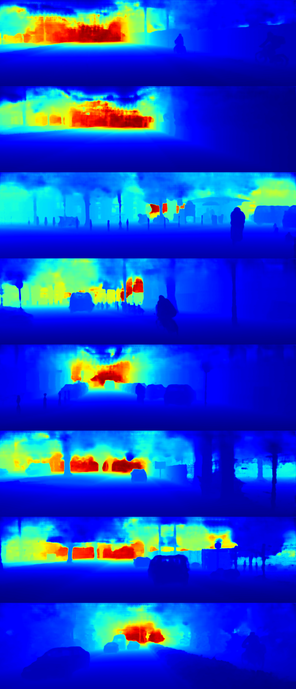

# PENet (ICRA 2021)

A paddle implementation of the paper [PENet: Towards Precise and Efficient Image Guided Depth Completion](https://arxiv.org/abs/2103.00783).


| RGB | input depth | pred dense dpeth | 
|:------:|:------:|:------:|
|  |  |  |


</font>

## Abstract

Image guided depth completion is the task of generating a dense depth map from a sparse depth map and a high quality image. In this task, how to fuse the color and depth modalities plays an important role in achieving good performance. This paper proposes a two-branch backbone that consists of a color-dominant branch and a depth-dominant branch to exploit and fuse two modalities thoroughly. More specifically, one branch inputs a color image and a sparse depth map to predict a dense depth map. The other branch takes as inputs the sparse depth map and the previously predicted depth map, and outputs a dense depth map as well. The depth maps predicted from two branches are complimentary to each other and therefore they are adaptively fused. In addition, we also propose a simple geometric convolutional layer to encode 3D geometric cues. The geometric encoded backbone conducts the fusion of different modalities at multiple stages, leading to good depth completion results. We further implement a dilated and accelerated CSPN++ to refine the fused depth map efficiently. The proposed full model ranks 1st in the KITTI depth completion online leaderboard at the time of submission. It also infers much faster than most of the top ranked methods. The code of this work is available at https://github.com/JUGGHM/PENet_ICRA2021.

## Dataset

In this framework, you need download frist step (sparse to coarse) data in AiStudio. You can download sparse to coarse depth image from the following link.

train-001: https://aistudio.baidu.com/aistudio/datasetdetail/176620

train-002: https://aistudio.baidu.com/aistudio/datasetdetail/176630

train-003: https://aistudio.baidu.com/aistudio/datasetdetail/176641

train-004: https://aistudio.baidu.com/aistudio/datasetdetail/176648

train-005: https://aistudio.baidu.com/aistudio/datasetdetail/176663

train-006: https://aistudio.baidu.com/aistudio/datasetdetail/176677

train-007: https://aistudio.baidu.com/aistudio/datasetdetail/176682

val: https://aistudio.baidu.com/aistudio/datasetdetail/176686

Warning: These files are about to 50GB，please ensure you have enough space to store.

When you have unzip these zip file. You need to create a file and run the following code in shell.

```bash
mkdir data
%cd data
mkdir train
mkdir val
%cd ~
```

Please make sure you move `train-001` to `train-007` files to `train` folder ,and move `val` files to `val` folder

```
train-001《====》2011_09_26_drive_0059_sync
train-002《====》2011_09_28_drive_0016_sync

|---data
|     |---train
|     |       |----2011_09_28_drive_0016_sync
|       .....
|     |       |----2011_10_03_drive_0042_sync
|     |---val
|     |       |----val/2011_09_26_drive_0002_sync
|       .....
|     |---depth_selection
|     |       |----test_depth_completion_anonymous
|     |       |----test_depth_prediction_anonymous
|     |       |----val_selection_cropped
|     |---data_json
```

**Note**: Besides you need to know that the zip file only include dense depth input image.You need to download rgb and groundtruth image form [KITTI Raw Website](http://www.cvlibs.net/datasets/kitti/raw_data.php) and [KITTI official Website](http://www.cvlibs.net/datasets/kitti/eval_depth.php?benchmark=depth_completion).

## Training

### Train ENet

Modify the configuration file `configs/PENet.yaml` and run the following command.

```yaml
# Model
model_name: penet

model:
    # Sub-model: e or pe
    network_model: "e"
    # CSPN++ dilation rate
    dilation_rate: 2 # 1, 2, 4
    # Information concatenated in encoder convolutional layers
    # "std", "z", "uv", "xyz"
    convolutional_layer_encoding: "xyz"
    # freeze backbone
    # ENet: False, DA-CSPN++: True, PENet: False
    freeze_backbone: False

# Dataset
dataset:
    name: "KITTI"
    data_folder: "datasets/kitti/data_depth_velodyne"
    input_mode: "rgbd"
    jitter: 0.1
    calib_path: "utils/calib_cam_to_cam.txt"
    not_random_crop: False
    # For ENet and DA-CSPN++
    random_crop_height: 320
    random_crop_width: 1216

# Optimizer
optimizer:
    name: Adam
    # ENet: 0.0005, DA-CSPN++: 0.0005, PENet: 0.001
    lr: 0.0005
    weight_decay: 1e-6


# Training related
epochs: 30
# Manual set epoch number
start_epoch: 0
start_epoch_bias: 0
# Resume training
# ENet: None, DA-CSPN++: the trained model of enet, PENet: the trained model of dacspn++
resume: None
train_mode: dense
pretrained: None
# Val mode
val: full
# Important setting####
evaluate:
# for test: evaluate: model_best.pdparams
#######################
rank_metric: rmse


# Others
# Number of data loading workers (default: 4)
workers: 4
batch_size: 6 # 10 for penet
print_freq : 10
```

```bash
python train.py --config configs/PENet.yaml
```

### Train DA-CSPN++

Modify the configuration file `configs/PENet.yaml` and run the following command.

```yaml
# Model
model_name: penet

model:
    # Sub-model: e or pe
    network_model: "pe"
    # CSPN++ dilation rate
    dilation_rate: 2 # 1, 2, 4
    # Information concatenated in encoder convolutional layers
    # "std", "z", "uv", "xyz"
    convolutional_layer_encoding: "xyz"
    # freeze backbone
    # ENet: False, DA-CSPN++: True, PENet: False
    freeze_backbone: True

# Dataset
dataset:
    name: "KITTI"
    data_folder: "datasets/kitti/data_depth_velodyne"
    input_mode: "rgbd"
    jitter: 0.1
    calib_path: "utils/calib_cam_to_cam.txt"
    not_random_crop: False
    # For ENet and DA-CSPN++
    random_crop_height: 320
    random_crop_width: 1216
    # For PENet
    # random_crop_height: 160
    # random_crop_width: 576

# Optimizer
optimizer:
    name: Adam
    # ENet: 0.0005, DA-CSPN++: 0.0005, PENet: 0.001
    lr: 0.0005
    weight_decay: 1e-6


# Training related
epochs: 2
# Manual set epoch number
start_epoch: 0
start_epoch_bias: 0
# Resume training
# ENet: None, DA-CSPN++: the trained model of enet, PENet: the trained model of dacspn++
resume: /path/to/your/enet/model
train_mode: dense
pretrained: None
# Val mode
val: full
# Important setting####
evaluate:
# for test: evaluate: model_best.pdparams
#######################
rank_metric: rmse


# Others
# Number of data loading workers (default: 4)
workers: 4
batch_size: 6 # 10 for penet
print_freq : 10
```

```bash
python train.py --config configs/PENet.yaml
```

### Train PENet

Modify the configuration file `configs/PENet.yaml` and run the following command.

```yaml
# Model
model_name: penet

model:
    # Sub-model: e or pe
    network_model: "pe"
    # CSPN++ dilation rate
    dilation_rate: 2 # 1, 2, 4
    # Information concatenated in encoder convolutional layers
    # "std", "z", "uv", "xyz"
    convolutional_layer_encoding: "xyz"
    # freeze backbone
    # ENet: False, DA-CSPN++: True, PENet: False
    freeze_backbone: False

# Dataset
dataset:
    name: "KITTI"
    data_folder: "datasets/kitti/data_depth_velodyne"
    input_mode: "rgbd"
    jitter: 0.1
    calib_path: "utils/calib_cam_to_cam.txt"
    not_random_crop: False
    # For PENet
    random_crop_height: 160
    random_crop_width: 576

# Optimizer
optimizer:
    name: Adam
    # ENet: 0.0005, DA-CSPN++: 0.0005, PENet: 0.001
    lr: 0.001
    weight_decay: 1e-6


# Training related
epochs: 75
# Manual set epoch number
start_epoch: 0
start_epoch_bias: 0
# Resume training
# ENet: None, DA-CSPN++: the trained model of enet, PENet: the trained model of dacspn++
resume: /path/to/your/dacspn/model
train_mode: dense
pretrained: None
# Val mode
val: full
# Important setting####
evaluate:
# for test: evaluate: model_best.pdparams
#######################
rank_metric: rmse


# Others
# Number of data loading workers (default: 4)
workers: 4
batch_size: 10 # 10 for penet
print_freq : 10

```

```bash
python train.py --config configs/PENet.yaml
```

## Evaluation

Modify the configuration file `configs/PENet.yaml`, change the `evaluate` to the path of your trained model and run the following command.

```bash
python evaluate.py --configs configs/PENet.yaml
```

## Models

[Pretrained Model](https://aistudio.baidu.com/datasetdetail/247312)
You can use this checkpoint to reproduce our reported result.

## Citation

If you find this code useful in your research, please cite:

```
@inproceedings{hu2021penet,
  title={Penet: Towards precise and efficient image guided depth completion},
  author={Hu, Mu and Wang, Shuling and Li, Bin and Ning, Shiyu and Fan, Li and Gong, Xiaojin},
  booktitle={2021 IEEE International Conference on Robotics and Automation (ICRA)},
  pages={13656--13662},
  year={2021},
  organization={IEEE}
}
```
