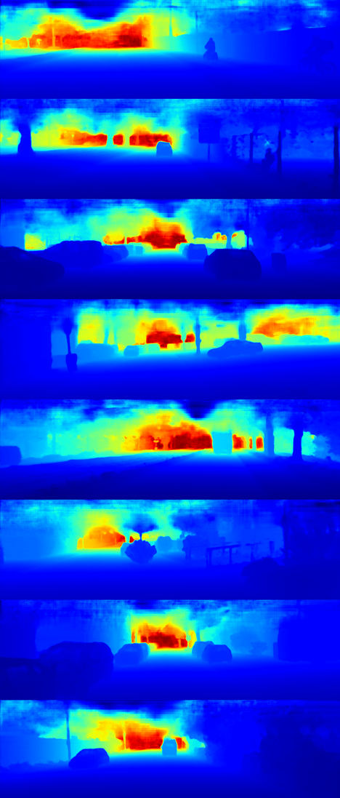

# STD(ICRA2019)

A paddle implementation of the paper Self-Supervised Sparse-to-Dense:self-Supervised Depth Completion from LiDAR and Monocular Camera

[\[ICRA 2019\]]([https://openaccess.thecvf.com/content/CVPR2021/html/Shen_CFNet_Cascade_and_Fused_Cost_Volume_for_Robust_Stereo_Matching_CVPR_2021_paper.html](https://arxiv.org/pdf/1807.00275.pdf))

when you train this model in 'gd',you will get the following reslut.You also can use torch2paddle weight to evaluate and visualize this result.

| gray            | input depth            | pred dense dpeth        | 
|----------------|------------------------|-------------------------|
|  |  |  |


</font>


## Abstract

Depth completion, the technique of estimating a
dense depth image from sparse depth measurements, has a
variety of applications in robotics and autonomous driving.
However, depth completion faces 3 main challenges: the irregularly spaced pattern in the sparse depth input, the difficulty in
handling multiple sensor modalities (when color images are
available), as well as the lack of dense, pixel-level ground
truth depth labels for training. In this work, we address all
these challenges. Specifically, we develop a deep regression
model to learn a direct mapping from sparse depth (and color
images) input to dense depth prediction. We also propose a selfsupervised training framework that requires only sequences of
color and sparse depth images, without the need for dense depth
labels. Our experiments demonstrate that the self-supervised
framework outperforms a number of existing solutions trained
with semi-dense annotations. Furthermore, when trained with
semi-dense annotations, our network attains state-of-the-art
accuracy and is the winning approach on the KITTI depth
completion benchmark1 at the time of submission.


## Dataset

Warning: These files are about to 50GB，please ensure you have enough  space to store.

When you have unzip these zip file.You need to create a file and run the following code in shell.


```bash

mkdir data

%cd data

mkdir train

mkdir val

%cd ~

```

Please make sure you move `train-001` to `train-007` files to `train` folder ,and move `val` files to `val` folder


```bash

.
├── self-supervised-depth-completion
├── data
|   ├── data_depth_annotated
|   |   ├── train
|   |   ├── val
|   ├── data_depth_velodyne
|   |   ├── train
|   |   ├── val
|   ├── depth_selection
|   |   ├── test_depth_completion_anonymous
|   |   ├── test_depth_prediction_anonymous
|   |   ├── val_selection_cropped
|   └── data_rgb
|   |   ├── train
|   |   ├── val
├── results
```


**Note**:Besides you need to know that the zip file only include dense depth input image.You need to download rgb and groundtruth image form [KITTI Raw Website](http://www.cvlibs.net/datasets/kitti/raw_data.php) and [KITTI official Website](http://www.cvlibs.net/datasets/kitti/eval_depth.php?benchmark=depth_completion).


## Training

**KITTI Depth dataset training**

Run the script `sh ./scripts/train_std.sh` to train on KITTI Depth  dataset.

```bash

python train.py -c configs/STD.yaml

```

You can use VisualDL to visualize the training process.
Run the script `visualdl --logdir ./log`


## Evaluation

Run the script `sh ./scripts/evaluate_std.sh` to test the trained model on KITTI Depth dataset and visualize the results.
The visualization results are saved in `./out/`.

**Important** : for evaluation , you need to download pretrained weight  from [this website](https://aistudio.baidu.com/aistudio/datasetdetail/202399)

and employ it as input of the proposed network.


you can run this 

```bash

python evaluate.py -c ./model_document/STD/STD.yaml

```


## Models


[Pretrained Model](https://aistudio.baidu.com/aistudio/datasetdetail/202399)

You can use this checkpoint to reproduce our reported result.


## Citation

If you find this code useful in your research, please cite:

```
@article{ma2018self,
	title={Self-supervised Sparse-to-Dense: Self-supervised Depth Completion from LiDAR and Monocular Camera},
	author={Ma, Fangchang and Cavalheiro, Guilherme Venturelli and Karaman, Sertac},
	booktitle={ICRA},
	year={2019}
}
@article{Ma2017SparseToDense,
	title={Sparse-to-Dense: Depth Prediction from Sparse Depth Samples and a Single Image},
	author={Ma, Fangchang and Karaman, Sertac},
	booktitle={ICRA},
	year={2018}
}
```

